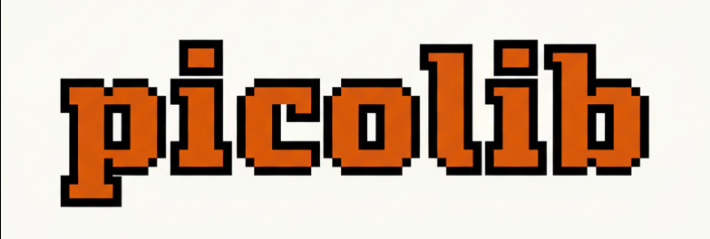

<p align="center">
  
</p>

<h1 align="center">Welcome to PicoLib!</h1>

<p align="center">
  <i>Building from the ground up. Exploring what's cool.</i>
</p>

---

## 🚀 Our Mission

At PicoLib, we're driven by curiosity and the joy of building. Our core mission is to **demystify complex AI/ML concepts and architectures** by recreating them from scratch in smaller, more manageable implementations.

We believe that true understanding comes from getting your hands dirty and building the foundational blocks yourself. Each project in our "library" (pico-lib!) is an exploration into the heart of a cutting-edge paper, a widely used architecture, or a fascinating piece of software.

While our primary focus is on AI/ML Engineering, we're software engineers at heart. This means we love to **explore other cool domains** too! Whether it's a neat data structure, a foundational algorithm from another field, or an interesting system design, if it sparks our curiosity, we're building a "pico-version" of it.

Join us in building, learning, and sharing the fascinating underlying mechanics of the tech world.

<p align="center">
  
</p>

---

## 📚 Our Library (Repository Format)

Every project in PicoLib follows a consistent structure to make learning and contributing as straightforward as possible.

### Standard `README.md` Format:

Each repository should adhere to this template:

# Project Title: [e.g., picotransformer]

## 💡 The Big Idea
_A concise, 1-2 paragraph explanation of the original concept, paper, or system this project is based on._
_Include a link to the original paper, documentation, or source._
**Example:** "This project is a small-scale implementation of the Transformer architecture, as introduced in the seminal paper 'Attention Is All You Need' (Vaswani et al., 2017). The Transformer revolutionized sequence modeling by replacing recurrent layers with self-attention mechanisms, leading to significant advancements in natural language processing. [Link to paper]"

## 🛠️ Our Pico Approach
_Explain what makes this implementation "pico" – what simplifications, core components, or specific aspects are focused on._
_This highlights the learning objectives and scope._
**Example:** "Our `picotransformer` focuses on the core encoder-decoder architecture. We've simplified the positional encoding to a basic sinusoidal implementation, used a small character-level vocabulary, and trained on a tiny synthetic dataset. The goal is to illustrate the self-attention and multi-head attention mechanisms, along with the overall data flow through the encoder and decoder blocks, rather than achieving state-of-the-art performance."

## 🚀 Key Concepts & Learnings
_A bulleted list of the fundamental concepts someone will understand by exploring this project's code._
**Example:**
* Scaled Dot-Product Attention (and Multi-Head Attention)
* Encoder-Decoder Architecture
* Feed-Forward Networks & Residual Connections
* Basic Positional Embeddings
* Training a sequence-to-sequence model

## 📦 How to Get Started
_Clear, concise instructions to set up and run the project._
_Typically includes cloning the repo, installing dependencies, and running a main script._

**Example:**
```bash
git clone https://github.com/PicoLibOrg/pico-transformer.git
cd pico-transformer
pip install -r requirements.txt
python main.py --train --epochs 10
`````
-----

## ✅ To-Do List & Ideas for Exploration

This is our evolving backlog of cool things to build\! We prioritize based on curiosity, learning value, and what the community finds interesting.

### AI/ML Fundamentals

  * **Pico-Tokenizer:** Implement various tokenizer algorithms (e.g., BPE, WordPiece, SentencePiece) from scratch.
  * **Pico-Grad:** Build a minimalist auto-differentiation engine (like Karpathy's Micrograd/NanoGrad).
  * **Pico-Optimizer:** Recreate common optimizers (SGD, Adam, AdamW) to understand their update rules.
  * **Pico-NNModule:** Develop a simplified version of PyTorch's `nn.Module` to grasp module composition.

### Modern LLM Architectures & Techniques

  * **Pico-LoRA:** Implement Low-Rank Adaptation for parameter-efficient fine-tuning.
  * **Pico-MoE:** Build a Mixture of Experts layer to understand sparse activation.
  * **Pico-DPO:** Replicate Direct Preference Optimization for model alignment.
  * **Pico-Diffusion:** A simplified diffusion model for image generation.

### Systems & Engineering

  * **Pico-VectorStore:** Implement a basic in-memory or file-based vector database.
  * **Pico-RAG:** Build a retrieval-augmented generation pipeline using your `pico-` components.
  * **Pico-InferenceServer:** A lightweight FastAPI/Flask server to deploy a `pico-` model.
  * **Pico-Quantization:** Implement post-training quantization (e.g., to INT8) for model compression.

### Beyond AI/ML (SWE Explorations)

  * **Pico-Blockchain:** A minimal blockchain implementation to understand core concepts.
  * **Pico-Interpreter:** Build a tiny interpreter for a simple programming language.
  * **Pico-RayTracer:** A basic ray tracer to explore computer graphics fundamentals.

-----

## 👥 Our Community

PicoLib thrives on shared passion. We encourage you to:

  * Star the repositories you find cool\!
  * Fork projects, experiment, and open Pull Requests.
  * Join discussions and share your ideas.

Let's build something amazing together\!

-----
